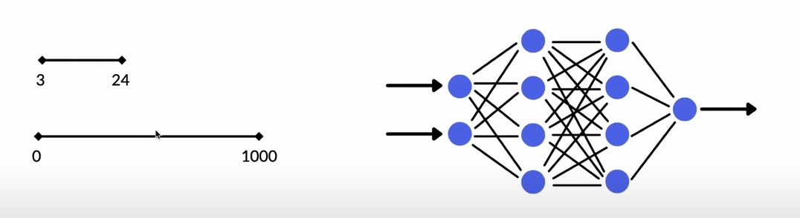
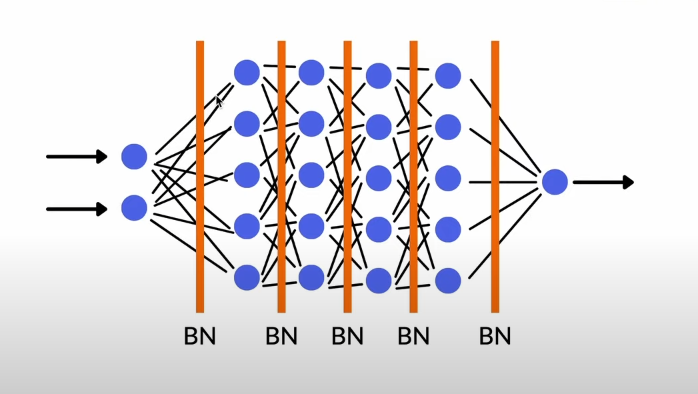
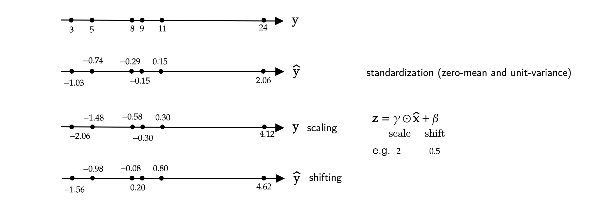
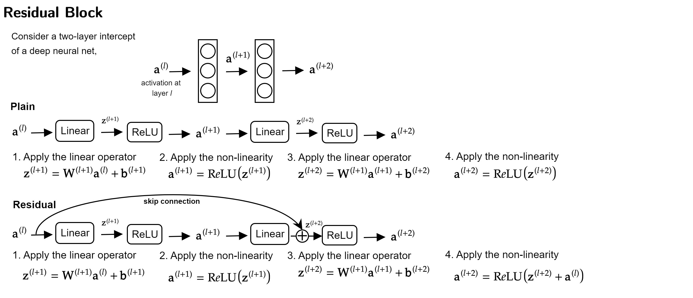
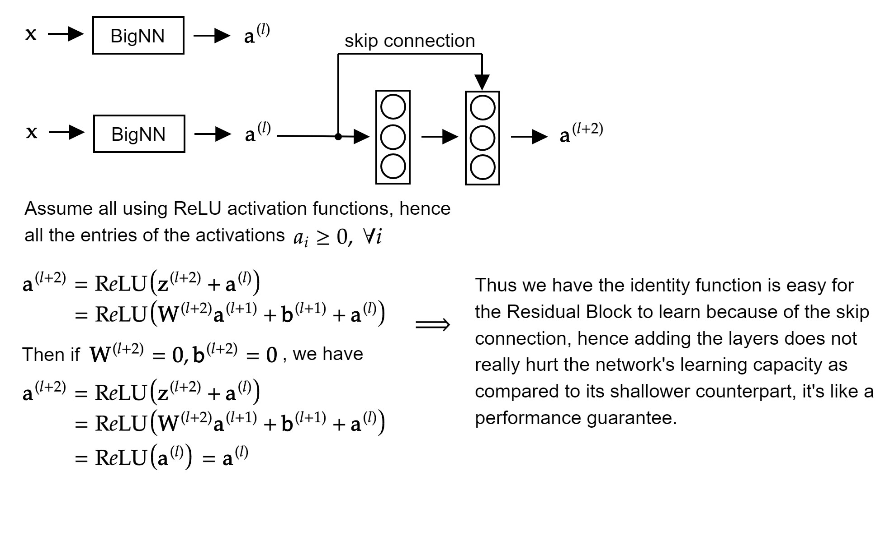

# Basic Building Blocks Used in the Model

## References

[1] Ioffe, Sergey, and Christian Szegedy. "Batch normalization: Accelerating deep network training by reducing internal covariate shift." International conference on machine learning. pmlr, 2015.
[2] Ramachandran, Prajit, Barret Zoph, and Quoc V. Le. "Searching for activation functions." arXiv preprint arXiv:1710.05941 (2017).

## Normalization

**Normalization** is collapsing inputs to be between 0 and 1 while **Standardization** is trying to make mean 0 and variance 1.

## Why Normalization?
  
We need normalization in neural networks as some times features are of different very different ranges of values. Take the simple neural net in the following figure for instance, say we have to features, one is number of phones that were ever owned by a customer and the other is the number of money they have withdrawn from the ATM today, it can be seen that both features have very different ranges of values, which creates a computational challenge for the network to learn the weight values to minimize the lost function, it will lead to very different weight values for different featues, and thus cause instability and vanishing/exploding gradients. Hence we choose to *normalize* the inputs to make the training more stable, however, similar problems might still happen again when the network becomes deeper, and that leads batch normalization [1] to our rescue.

Instead of **only** normalizing the inputs, we normalize all the outputs from all the layers in the network, as shown in the diagram below,

The following diagram shows a toy example of doing batch normalization on a set of input values,

A few key points of Batch Normalization,

- Epochs will take longer due to the additional computations introduced for batch normalization but the convergence will be faster.
- Achieves the same accuracy faster.
- Can lead to better perfomance.
- No need to have a standardization layer.
- Reduces the need to other regularization.

## The Swish Activation Function

**Swish** is an activation function defined as,
$$f(x) = x \cdot \mathrm{sigmoid} (\beta x),$$
where $\beta$ is a learnable parameter and
$$\sigma(z) = (1 + \mathrm{exp}(-z))^{-1}.$$
The activation function is proposed to replace  ReLU with automated search techniques and has shown impressive performance in various image classification and machine translation tasks as compared to the popular ReLU.

In practice, nearly all implementations do not use the learnable parameter $\beta$, in which case the activation function is $x \sigma(x)$ ("Swish-$1$"), which is also equivalent to the Sigmoid-weighted Linear Unit (SiLU) as proposed by Elfwing *et al.* Note that if $\beta = 0$, Swish becomes the scaled linear function $f(x) = x / 2$, and if $\beta \to \infty$, the sigmoid component approaches a $0-1$ function, so Swish behaves like a ReLU function. Thus,
> the Swish activation function can be loosely viewed as a smooth function which nonlinearly interpolates between the linear function and the ReLU function, and the trainable parameter $\beta$ controls the degree of that interpolation.

Similar to ReLU, the Swish activation function is unbounded above and bounded below, but smooth and non-monotonic. The non-monotonicity is of the distinguishing properties of the Swish activation functions as compared other common activation functions. The derivative of the Swish activation function is,
$$
\begin{aligned}
f'(x) &= \sigma(\beta x) + \beta x \cdot \sigma (\beta x) (1 - \sigma(\beta x)) \\
&= \sigma(\beta x) + \beta x \cdot \sigma(\beta x) - \beta x \cdot \sigma(\beta x)^2 \\
&= \beta x \cdot \sigma(x) + \sigma(\beta x)(1 - \beta x \cdot \sigma(\beta x)) \\
&= \beta f(x) + \sigma(\beta x)(1 - \beta f(x)).
\end{aligned}
$$

## The Residual Block

Traditional neural networks suffer issues like vanishing or exploding gradients and exhibit worse performance when the network goes deeper. The residual blocks enable the network to perform better with more depth by utilizing skip connections, as shown in the diagram below,

### Why Do Residual Networks Work?

As shown in the diagram below, the diagram below shows that the skip connection helps guarantee the network can at least preserve the performance
of its shallower counterpart by easily learning the identity function as the network goes deeper.

Another thing to note that the above diagram assumes that $\mathbf{z}^{(l+2)}$ and $\mathbf{a}^{(l)}$ are of the same dimension for the addition to work, hence we usually apply the **same** convolution operation to make the dimensions match. However, when the dimensions don't match, we usually apply a projection matrix $\mathbf{W}_s$. Say we have $\mathbf{a}^{(l+2)} \in \mathbb{R}^{256}$ and $\mathbf{a}^{(l)} \in \mathbb{R}^{128}$, then we modify the operations as,

$$
\begin{aligned}
    \mathbf{a}^{(l+2)} &= \mathrm{ReLU}(\mathbf{z}^{(l+2)} + \mathbf{W}_s\mathbf{a}^{(l)})\\
    &= \mathrm{ReLU}(\mathbf{W}^{(l+2)}\mathbf{a}^{(l+1)} + \mathbf{b}^{(l+1)}+\mathbf{W}_s\mathbf{a}^{(l)})
\end{aligned}
$$
